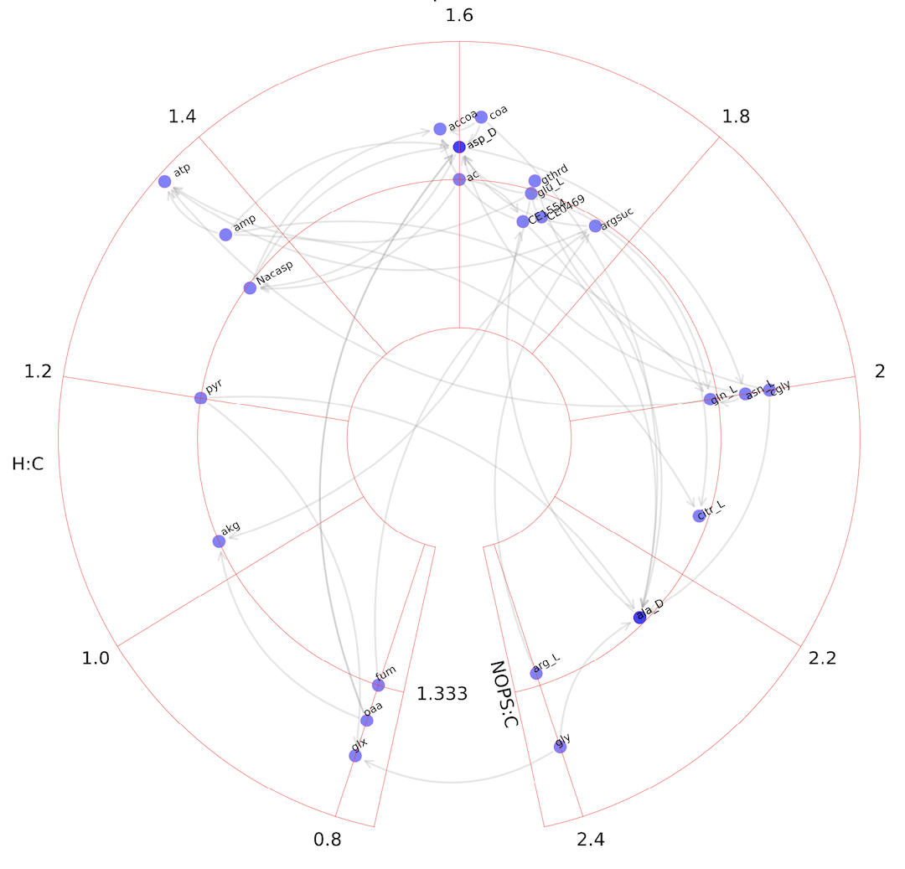

# Circular van Krevelen diagram for visualizing metabolic pathways

We postulate that a coordinate system based on elemental ratios can support a new generation of metabolic pathway visualization at the interface between humans and computers. 

This is the repo for lcvk package, which includes code, example data and notebook templates.

Version 0.1 is proof of principle. 

